# EX-05-Feature-Generation


## AIM
To read the given data and perform Feature Generation process and save the data to a file. 

# Explanation
Feature Generation (also known as feature construction, feature extraction or feature engineering) is the process of transforming features into new features that better relate to the target.
 

# ALGORITHM
### STEP 1
Read the given Data
### STEP 2
Clean the Data Set using Data Cleaning Process
### STEP 3
Apply Feature Generation techniques to all the feature of the data set
### STEP 4
Save the data to the file


# CODE

DATA.CSV
```
import pandas as pd
df=pd.read_csv("data.csv")
df
from sklearn.preprocessing import LabelEncoder, OrdinalEncoder
oe=OrdinalEncoder()
oe.fit_transform(df[["Ord_1"]])
temp=['Cold','Warm','Hot','Very Hot']
enc=OrdinalEncoder(categories=[temp])
enc
enc.fit_transform(df[['Ord_1']])
df1=df.copy()
df1["Ord_1"]=enc.fit_transform(df[["Ord_1"]])
df1
oe1=OrdinalEncoder()
oe.fit_transform(df[["Ord_2"]])
studies=['High School','Diploma','Bachelors','Masters','PhD']
enc1=OrdinalEncoder(categories=[studies])
enc1
enc1.fit_transform(df[['Ord_2']])
df2=df1.copy()
df2["Ord_2"]=enc1.fit_transform(df[["Ord_2"]])
df2
from category_encoders import BinaryEncoder
be=BinaryEncoder()
newdata=be.fit_transform(df2["bin_1"])
newdata
df3=df2.copy()
df3["bin_1"]=be.fit_transform(df[["bin_1"]])
df3
be1=BinaryEncoder()
newdata2=be1.fit_transform(df3['bin_2'])
newdata2
df4=df3.copy()
df4["bin_2"]=be1.fit_transform(df[["bin_2"]])
df4
from sklearn.preprocessing import OneHotEncoder
ohe=OneHotEncoder(sparse=False)
ohe.fit_transform(df4[['City']])
num=ohe.fit_transform(df4[['City']])
num
df4
from sklearn.preprocessing import LabelEncoder, OrdinalEncoder
le=LabelEncoder()
le.fit_transform(df4[['City']])
df5=df4.copy()
df5["City"]=le.fit_transform(df4[['City']])
df5

from sklearn.preprocessing import MinMaxScaler
scaler=MinMaxScaler()
df6=pd.DataFrame(scaler.fit_transform(df5),columns=['id', 'bin_1', 'bin_2', 'City', 'Ord_1','Ord_2','Target'])
df6

from sklearn.preprocessing import StandardScaler
Stdscaler=StandardScaler()
df7=pd.DataFrame(Stdscaler.fit_transform(df5),columns=['id', 'bin_1', 'bin_2', 'City', 'Ord_1','Ord_2','Target'])
df7

from sklearn.preprocessing import MaxAbsScaler
maxabsscaler=MaxAbsScaler()
df8=pd.DataFrame(maxabsscaler.fit_transform(df5),columns=['id', 'bin_1', 'bin_2', 'City', 'Ord_1','Ord_2','Target'])
df8

from sklearn.preprocessing import RobustScaler
rscaler = RobustScaler()
df9=pd.DataFrame(rscaler.fit_transform(df5),columns=['id', 'bin_1', 'bin_2', 'City', 'Ord_1','Ord_2','Target'])
df9
```

# OUPUT


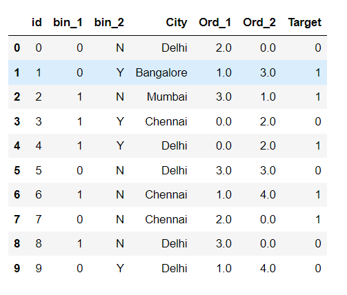

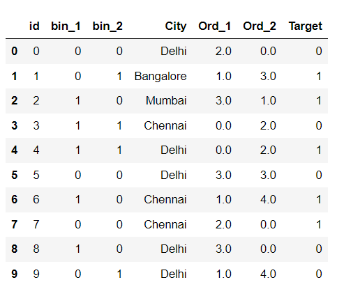


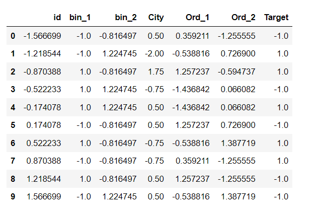


# CODE :

ENCODING_DATA.CSV:
```
import pandas as pd
df=pd.read_csv("Encoding Data.csv")
df
from sklearn.preprocessing import LabelEncoder, OrdinalEncoder
oe=OrdinalEncoder()
oe.fit_transform(df[["ord_2"]])
temp=['Cold','Warm','Hot']
enc=OrdinalEncoder(categories=[temp])
enc
enc.fit_transform(df[['ord_2']])
df1=df.copy()
df1["ord_2"]=enc.fit_transform(df[["ord_2"]])
df1
oe1=OrdinalEncoder()
oe.fit_transform(df[["nom_0"]])
color=['Green','Blue','Red']
enc1=OrdinalEncoder(categories=[color])
enc1
enc1.fit_transform(df[['nom_0']])
df2=df1.copy()
df2["nom_0"]=enc1.fit_transform(df[["nom_0"]])
df2

from category_encoders import BinaryEncoder
be=BinaryEncoder()
newdata=be.fit_transform(df2["bin_1"])
newdata
df3=df2.copy()
df3["bin_1"]=be.fit_transform(df[["bin_1"]])
df3
be1=BinaryEncoder()
newdata2=be1.fit_transform(df3['bin_2'])
newdata2
df4=df3.copy()
df4["bin_2"]=be1.fit_transform(df[["bin_2"]])
df4

from sklearn.preprocessing import MinMaxScaler
scaler=MinMaxScaler()
df5=pd.DataFrame(scaler.fit_transform(df4),columns=['id', 'bin_1', 'bin_2', 'nom_0','ord_2'])
df5

from sklearn.preprocessing import StandardScaler
Stdscaler=StandardScaler()
df6=pd.DataFrame(Stdscaler.fit_transform(df4),columns=['id', 'bin_1', 'bin_2', 'nom_0','ord_2'])
df6

from sklearn.preprocessing import MaxAbsScaler
maxabsscaler=MaxAbsScaler()
df7=pd.DataFrame(maxabsscaler.fit_transform(df4),columns=['id', 'bin_1', 'bin_2', 'nom_0','ord_2'])
df7

from sklearn.preprocessing import RobustScaler
rscaler = RobustScaler()
df8=pd.DataFrame(rscaler.fit_transform(df4),columns=['id', 'bin_1', 'bin_2', 'nom_0','ord_2'])
df8
```
# OUTPUT :


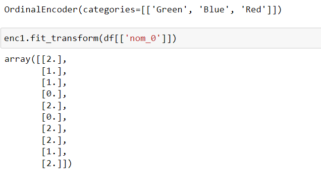
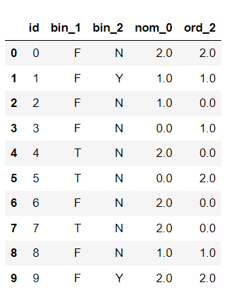

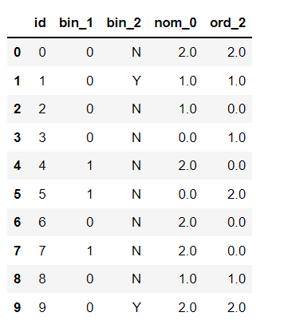


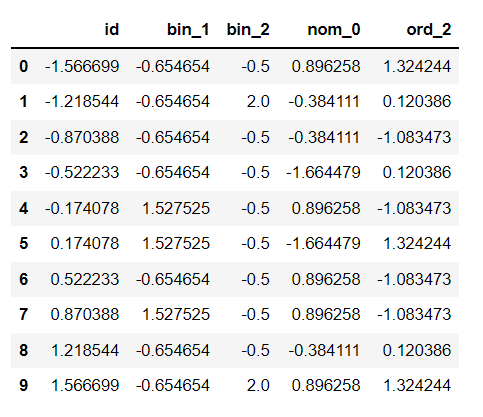
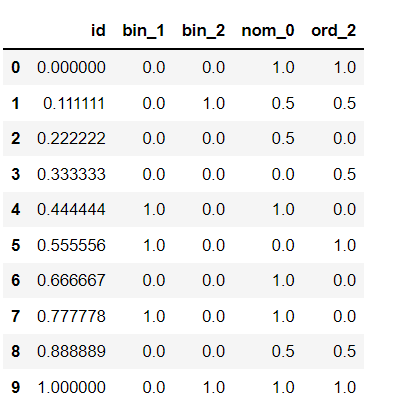
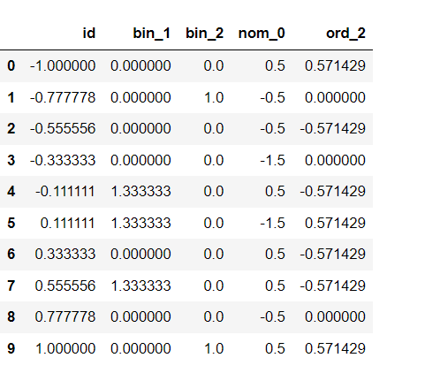


# CODE :

TITANIC_DATASET.CSV :
```
import pandas as pd
df=pd.read_csv("titanic_dataset.csv")
df
df.drop("Name",axis=1,inplace=True)
df
df.drop("Cabin",axis=1,inplace=True)
df
df.drop("Ticket",axis=1,inplace=True)
df
df.info()
df.isnull().sum()
df["Age"]=df["Age"].fillna(df["Age"].median())
df["Embarked"]=df["Embarked"].fillna(df["Embarked"].mode()[0])
df.boxplot()
df.isnull().sum()
df

from sklearn.preprocessing import LabelEncoder, OrdinalEncoder
oe=OrdinalEncoder()
oe.fit_transform(df[["Embarked"]])
embark=['S','C','Q']
enc=OrdinalEncoder(categories=[embark])
enc
enc.fit_transform(df[['Embarked']])
df1=df.copy()
df1["Embarked"]=enc.fit_transform(df[["Embarked"]])
df1

from category_encoders import BinaryEncoder
be=BinaryEncoder()
newdata=be.fit_transform(df1["Sex"])
newdata
df2=df1.copy()
df2["Sex"]=be.fit_transform(df1[["Sex"]])
df2

from sklearn.preprocessing import MinMaxScaler
scaler=MinMaxScaler()
df3=pd.DataFrame(scaler.fit_transform(df2),columns=['Passenger','Survived','Pclass','Sex','Age','SibSp','Parch','Fare','Embarked'])
df3

from sklearn.preprocessing import StandardScaler
Stdscaler=StandardScaler()
df4=pd.DataFrame(Stdscaler.fit_transform(df2),columns=['Passenger','Survived','Pclass','Sex','Age','SibSp','Parch','Fare','Embarked'])
df4

from sklearn.preprocessing import MaxAbsScaler
maxabsscaler=MaxAbsScaler()
df5=pd.DataFrame(maxabsscaler.fit_transform(df2),columns=['Passenger','Survived','Pclass','Sex','Age','SibSp','Parch','Fare','Embarked'])
df5

from sklearn.preprocessing import RobustScaler
rscaler = RobustScaler()
df6=pd.DataFrame(rscaler.fit_transform(df2),columns=['Passenger','Survived','Pclass','Sex','Age','SibSp','Parch','Fare','Embarked'])
df6

```
# OUTPUT :


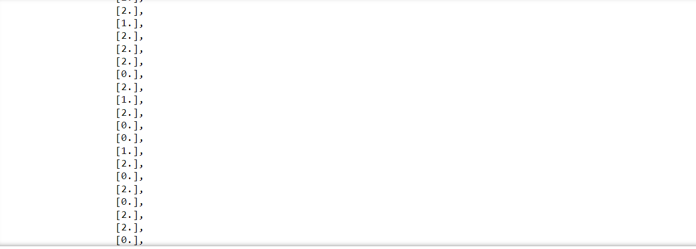

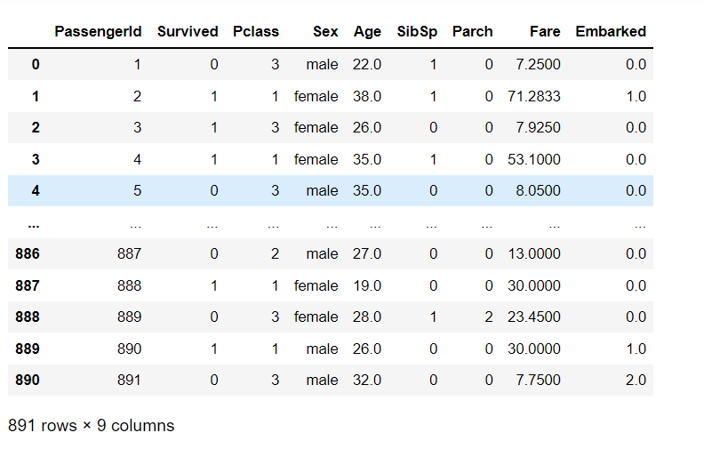

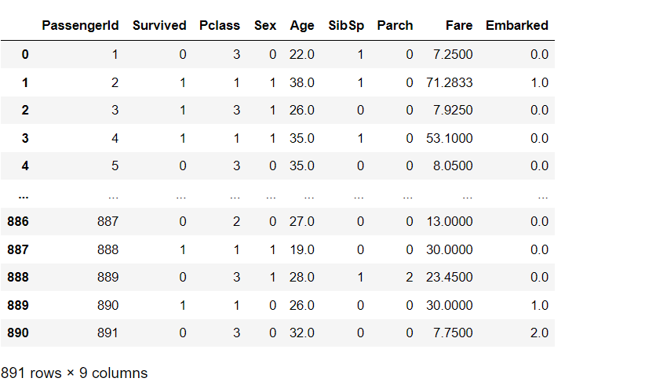

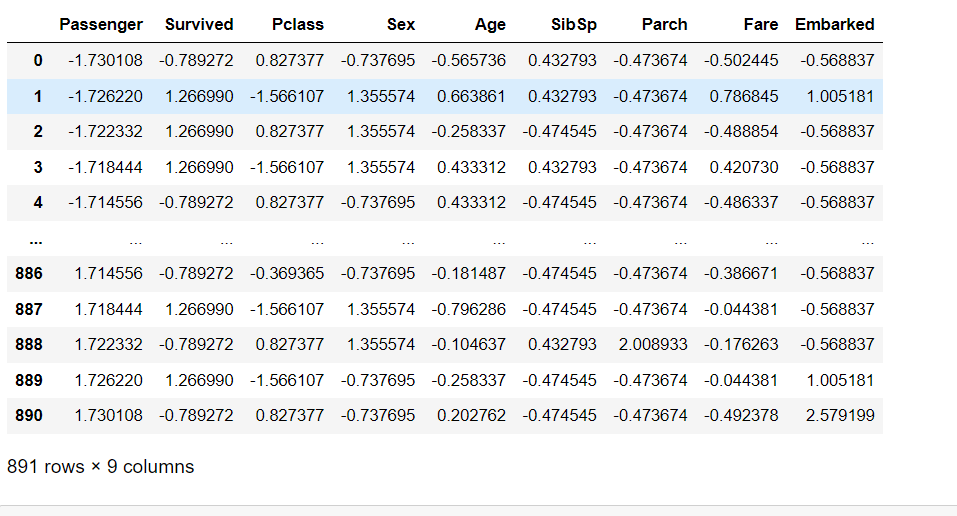


# RESULT :
Feature Generation process and Feature Scaling process is applied to the given data frames sucessfully.
